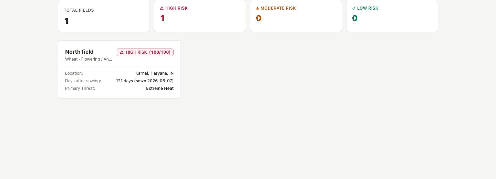
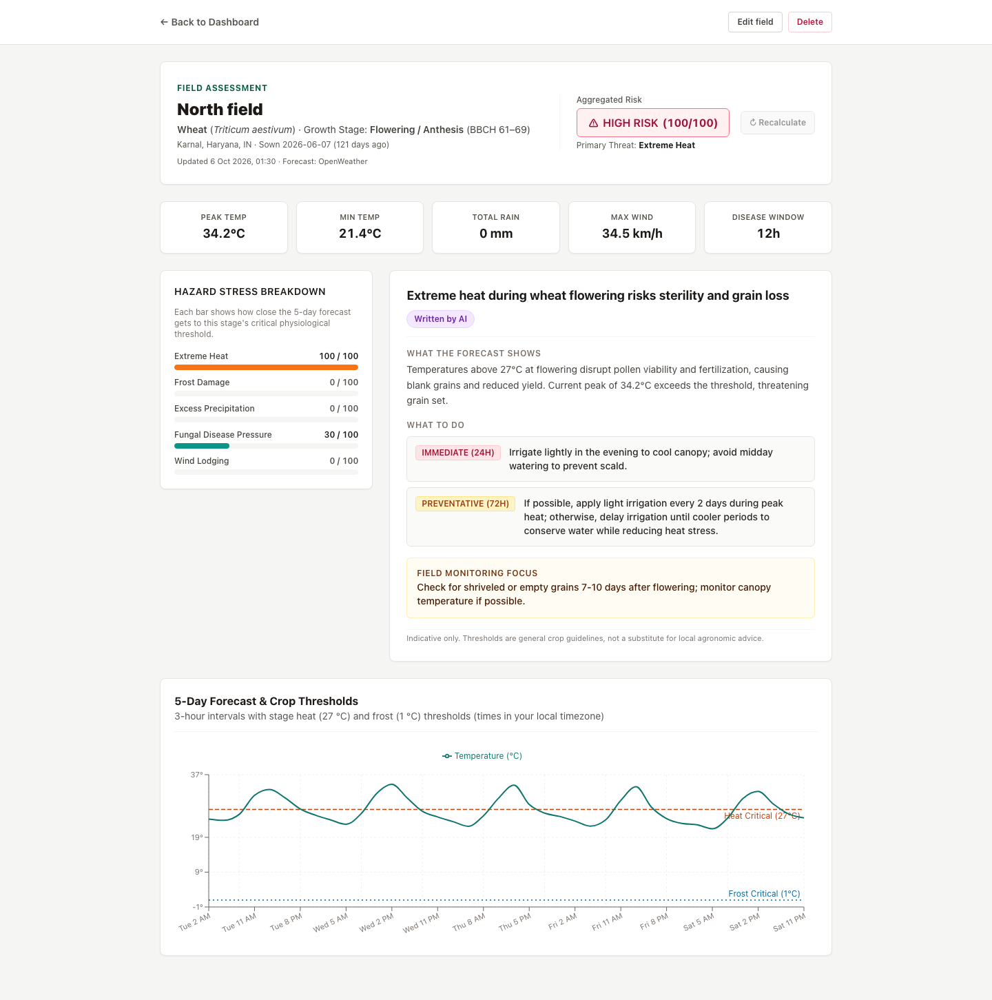

# CropRisk

[](https://github.com/Krish3101/croprisk/actions/workflows/tests.yml)

A heat wave of 35 °C means grain loss for wheat at flowering, and very little for wheat that has already ripened. Generic weather apps can't tell those two fields apart.

Same weather, different risk: CropRisk scores a 5-day forecast into a 0–100 risk for one field's crop and growth stage across five hazards. A pure, test-vector-checked engine makes the number; an LLM only explains it.





**Stack:** FastAPI, SQLAlchemy, SQLite (WAL), OpenWeather; React, TypeScript, TanStack Query, Recharts, Tailwind, Vite, Vitest.

## What it is

A decision-support prototype, not an advisory product. The thresholds in [`backend/app/data/crops.yaml`](backend/app/data/crops.yaml) are **indicative and unsourced**: every crop and stage has `source: "unsourced"`. They are reasonable starting values, and that file is where an agronomist's checked values would plug in. Editing it changes the catalogue fingerprint, so every stored assessment is re-scored on its next read (or re-fetched, if its forecast is over 12 h old).

## How scoring works

The catalogue has 6 crops (**wheat, rice, maize, cotton, soybean, mustard**) with 5 growth stages each. Each stage has its own thresholds and hazard weights. The engine (`backend/app/domain/engine.py`) takes 3-hourly forecast intervals and computes five hazard indices, each 0–100:

| Hazard | Input | Index |
|---|---|---|
| Heat | Temperatures above the stage's critical heat `t_crit` | 70 × (peak excess ÷ (`t_lethal` − `t_crit`)) + 30 × (degree-hours above `t_crit` ÷ 36), each part capped |
| Frost | Lowest temperature | 100 × (`t_crit` − min) ÷ (`t_crit` − `t_lethal`), clamped to 0–100 |
| Excess rain | Wettest rolling 24 h (8 intervals) | 100 × (rain − `r_crit_24h`) ÷ (`r_flood_24h` − `r_crit_24h`), clamped |
| Fungal disease | Longest run of intervals with RH ≥ the crop's `rh_crit` and temperature inside its disease band | 0 below 12 h; then 30 + 70 × (hours − 12) ÷ 24, capped at 100 |
| Wind lodging | Strongest wind or gust | 100 × (wind − `w_crit_lodge`) ÷ (`w_severe` − `w_crit_lodge`), clamped |

The score is `max(weighted sum, largest weighted index ÷ largest weight)`, rounded half-up and capped at 100. The second term stops one severe hazard from being averaged away. There are **three** bands: **LOW** 0–29, **MODERATE** 30–65, **HIGH** 66–100. The primary threat is the hazard with the largest weighted contribution (ties: frost > heat > rain > wind > disease).

The engine does no I/O and is checked against 10 golden vectors whose derivations are in [docs/engine.md](docs/engine.md).

## Why the LLM can't change the score

The score is computed and stored before any text is written. Then:

- **LOW:** fixed "no weather risk" text, no LLM call.
- **MODERATE / HIGH with `OPENROUTER_API_KEY`:** the model gets the finished numbers (score, band, primary threat, hazard indices, weather digest) and must reply with JSON matching a schema. Anything invalid is thrown away.
- **No key or a failed call:** a rule-based fallback built only from the engine's numbers and the stage threshold. For a wheat field at flowering with a −1.5 °C night (from `tests/test_advisory.py`):

  > **Frost risk for Wheat at Flowering / Anthesis**
  > Over the next five days the lowest temperature is -1.5 °C; the threshold for this stage is 1.0 °C. Risk score 71/100 (HIGH).

## Caching

Each field has one stored assessment, which also keeps the forecast it was scored from.

- It is served as-is only for the same **location (lat/lon to 2 decimals), growth stage and catalogue version**.
- The TTL is **12 h from when the forecast was fetched**. Re-scoring does not reset that clock.
- A **stage change re-scores the stored forecast with no API call** (if it is under 12 h old). A location change always fetches a new forecast.
- Forced refresh is `POST /api/plots/{id}/risk/refresh`. Within **10 minutes** of the last fetch it returns the cached assessment with `refreshed: false`, and the Recalculate button stays disabled until then.
- If OpenWeather is down, the last assessment for the same location is served with `is_stale: true`, for at most **48 h** after its fetch; the dashboard marks it stale for the same 48 h. After that the API returns 503.
- A per-field lock means two requests for the same new field make one upstream call. The lock lives in memory, so this holds for **one process** only.

## No auth, so what protects it

It is a single-user app meant for your own machine. The API binds to **127.0.0.1**, `TrustedHostMiddleware` rejects any `Host` header other than `127.0.0.1`, `localhost` or `*.localhost` (which blocks DNS rebinding), anything with a side effect is a POST, PATCH or DELETE, and there is **no CORS** middleware, so other sites can't read responses.

## Run

Requires Python 3.12+, Node 22, and ideally [uv](https://docs.astral.sh/uv/).

```bash
./scripts/start.sh            # backend on API_PORT (8000), frontend on WEB_PORT (5173)
./scripts/start.sh --reset    # delete the local database and caches
```

On first run it copies `backend/.env.example` to `backend/.env`; add your OpenWeather key there. If you have a database from an older version, the backend refuses to start with `schema vN found, expected 3: run ./scripts/start.sh --reset`.

Manual setup:

```bash
cd backend && uv sync --extra dev && uv run uvicorn app.main:app --reload --host 127.0.0.1 --port 8000
cd frontend && npm ci && npm run dev
```

## Configuration

Set in `backend/.env` (environment variables win):

| Variable | Purpose | Default |
|---|---|---|
| `OPENWEATHER_API_KEY` | Forecast and geocoding. Without it the app runs, but risk and search return 503. | empty |
| `OPENROUTER_API_KEY` | Optional. LLM explanations; without it the rule-based text is used. | empty |
| `DATABASE_URL` | SQLite URL | `croprisk.db` inside `backend/` (absolute path, so the working directory doesn't matter) |
| `LOG_LEVEL` | Python log level | `INFO` |
| `API_PORT` | Backend port for `start.sh` and the Vite proxy | `8000` |
| `WEB_PORT` | Frontend port for `start.sh` | `5173` |

## API

| Method | Path | What it does |
|---|---|---|
| `GET` | `/api/health` | Status, DB check, which keys are set, catalogue version, schema version |
| `GET` | `/api/crops` | Crops and their stages |
| `GET` | `/api/geocode?q=` | Place search (2–100 chars) |
| `GET` | `/api/plots` | All fields with their latest risk, highest first |
| `POST` | `/api/plots` | Add a field |
| `PATCH` | `/api/plots/{id}` | Edit a field; fields may be left out but not sent as `null` |
| `DELETE` | `/api/plots/{id}` | Delete a field and its assessment |
| `GET` | `/api/plots/{id}/risk` | Assessment, advice and forecast (cached as above) |
| `POST` | `/api/plots/{id}/risk/refresh` | Fetch a new forecast unless inside the 10-minute cooldown |

Errors use one shape: `{"error": {"code", "message", "fields?"}}`. A field whose stage is no longer in the catalogue gives 409 `catalogue_mismatch`. Swagger is at `http://localhost:8000/docs`.

## Tests

```bash
cd backend && uv run pytest && uv run ruff check . && uv run ruff format --check .
cd frontend && npm test && npm run build
```

**98 backend tests:** the 10 golden vectors and hazard edge cases, catalogue validation, forecast parsing over an OpenWeather-shaped fixture with `httpx.MockTransport` (missing values, HTML, 401, 429, timeouts), caching rules (location change, stage flips, 12 h TTL, 48 h cap, cooldown), two concurrent first loads making one call, the schema gate, TrustedHost, and that the API key never reaches the logs. No test calls a real API.

**14 frontend tests:** the location picker (keyboard selection, geocode failure alert), the chart's threshold lines, the Recalculate cooldown, the Edit button on a direct page load and the 404/503 pages, the field dialog (stage list, focus on the first invalid field, server errors), and the score badge.

## Limitations

- Thresholds are indicative and unsourced (see above).
- The growth stage is entered by hand; it is not inferred from the sowing date.
- Single user, single process, no push alerts: you have to open the app.
- The schema is not migrated. If it keeps changing, the next step is Alembic.

## License

[MIT](LICENSE)
